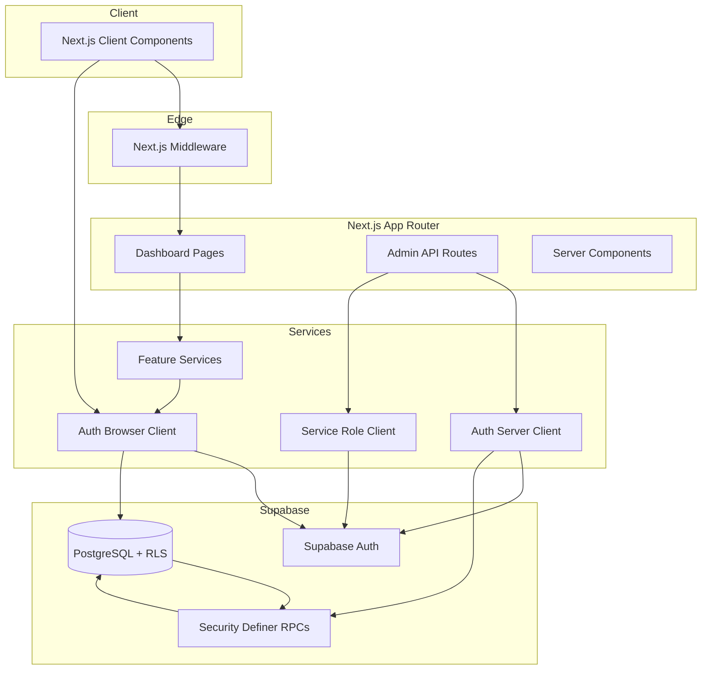

# Architecture Diagram

## Layers

| Layer | Responsibility |
|-------|----------------|
| Middleware | Session refresh, route protection |
| Client Components | UI, form validation, read via anon client |
| API Routes | Admin-only auth operations (invite, recovery) |
| RPCs | Privileged mutations, audit logging |
| RLS | Row-level data access per role |

## Security Boundaries

- Anon key + RLS for standard CRM operations
- Service role **only** in server API routes for Supabase Auth admin
- Admin mutations via `SECURITY DEFINER` RPCs with explicit guards
