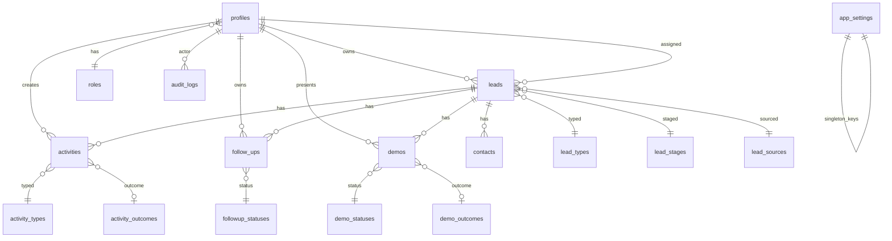

# Database Diagram

## Core Tables

| Table | Purpose |
|-------|---------|
| `profiles` | User identity linked to Supabase Auth |
| `roles` | admin, ceo, manager, executive |
| `leads` | Primary CRM entity (soft delete via `deleted_at`) |
| `contacts` | Lead contacts (archive via `archived_at`) |
| `activities` | Activity timeline |
| `follow_ups` | Follow-up tasks |
| `demos` | Demo lifecycle |
| `audit_logs` | Admin and system audit trail |
| `app_settings` | Organization configuration (key/value) |
| Lookup tables | `lead_types`, `lead_stages`, `lead_sources`, `activity_types`, `activity_outcomes`, `demo_statuses`, `demo_outcomes`, `followup_statuses` |

## Archive Strategy

| Entity | Archive mechanism |
|--------|-------------------|
| Leads | `deleted_at` soft delete |
| Contacts | `archived_at` + `is_active` |
| Demos | `cancelled` demo status |
| Users | `inactive` / `suspended` status (not archived) |

## RLS Summary

- Leads: owner/assignee access; admin/CEO settings visibility for archives
- Profiles: role-scoped user management; self-update guarded by trigger
- Settings: admin write, admin/CEO read
- Audit logs: admin/CEO read only

See [persistence design](../persistence/persistence-design.md) for full specification.
