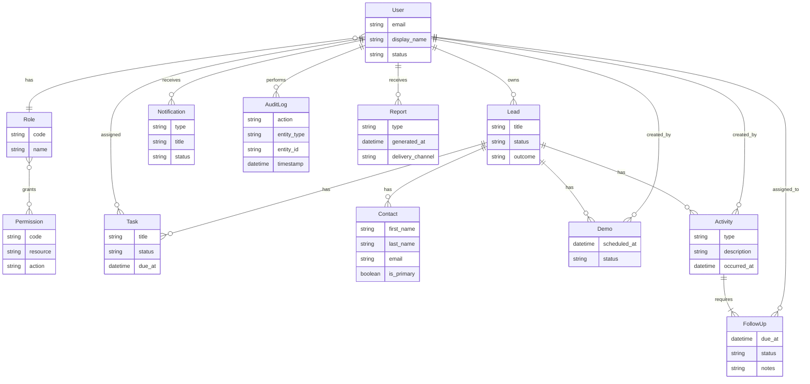
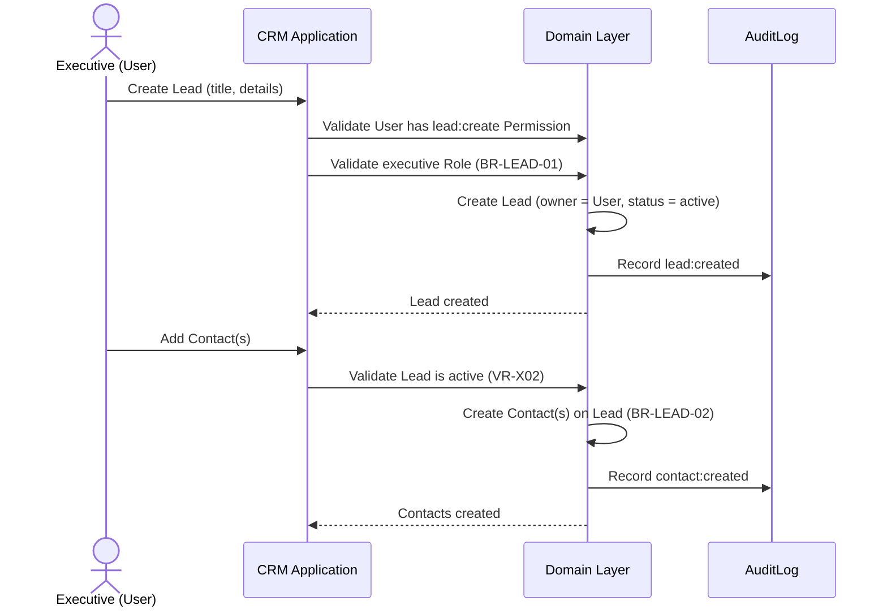
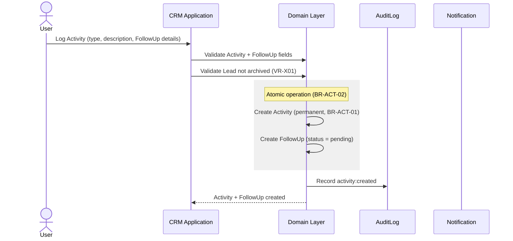
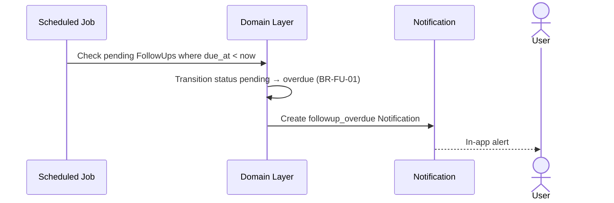
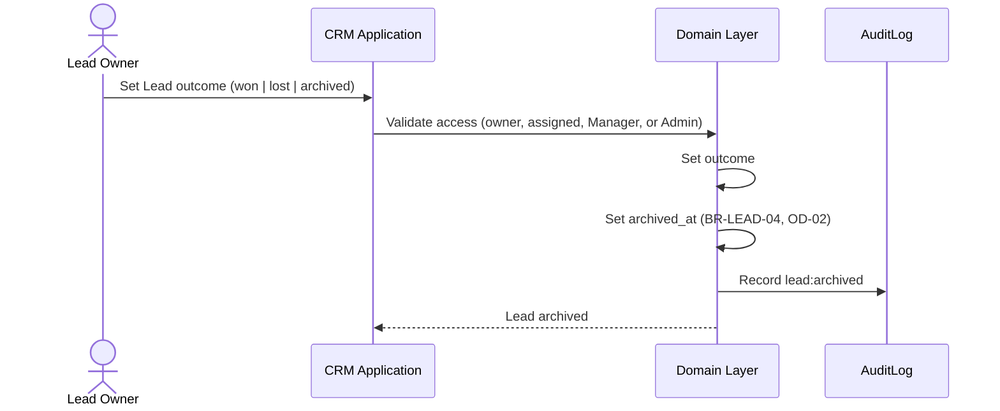
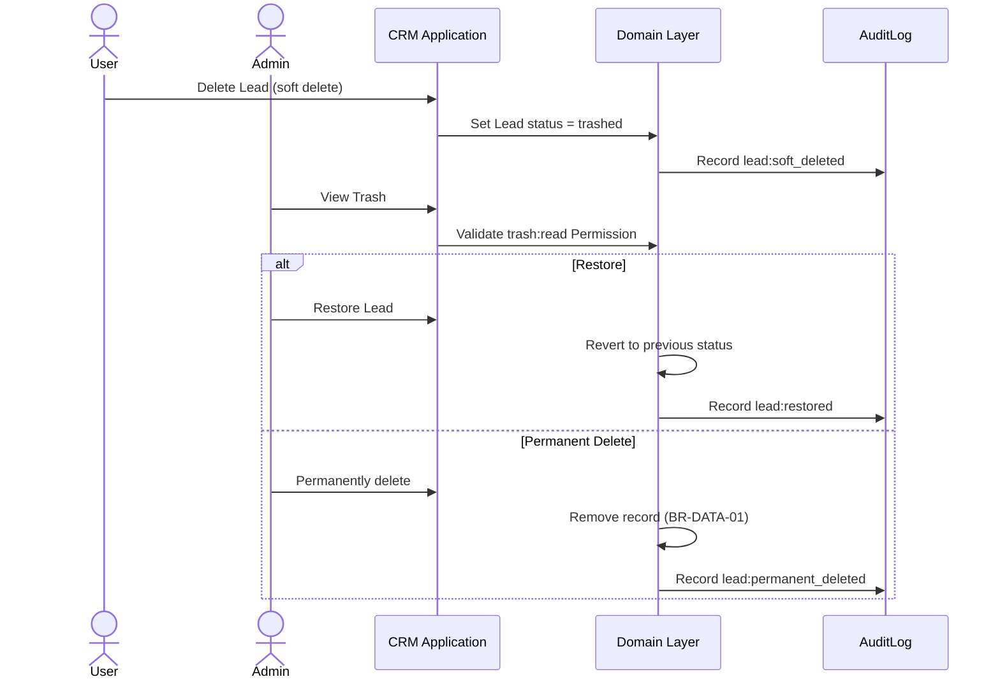
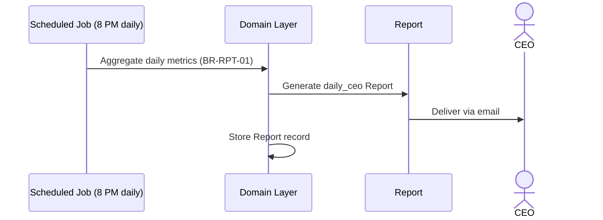
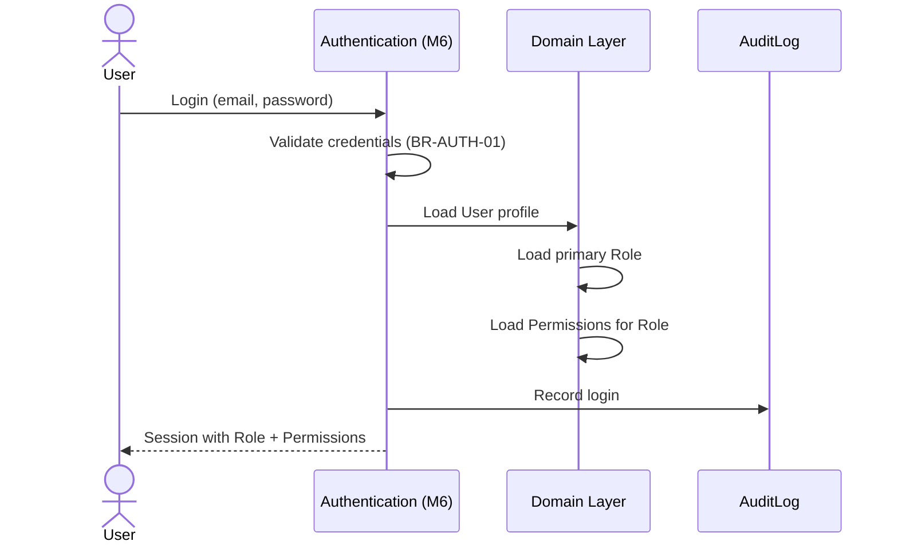
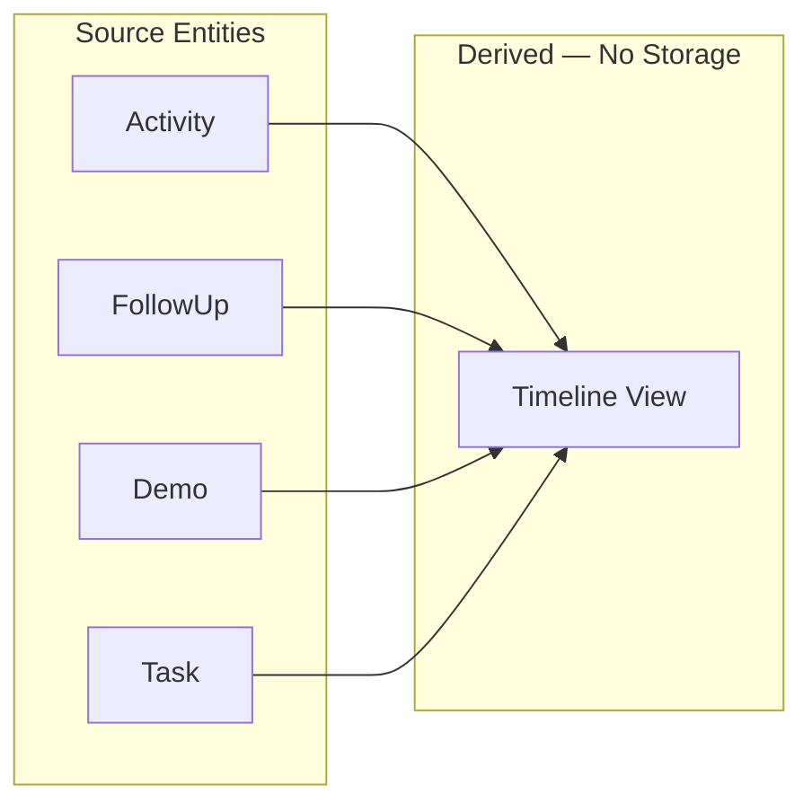

# Domain Model

Business domain model for TalentProof Sales CRM.

**Status**: Milestone 4 — Approved  
**Scope**: Business concepts only — no SQL, no tables, no implementation

## Document Index

| Section | Content |
|---------|---------|
| [1. Overview](#1-overview) | Purpose, principles, bounded context |
| [2. Business Entities](#2-business-entities) | All entities with responsibilities |
| [3. Relationships & Cardinality](#3-relationships--cardinality) | How entities connect |
| [4. Entity Lifecycles](#4-entity-lifecycles) | Birth to end-state per entity |
| [5. Business Rules](#5-business-rules) | Domain rules with IDs |
| [6. Validation Rules](#6-validation-rules) | Field and cross-entity validation |
| [7. State Transitions](#7-state-transitions) | State machines |
| [8. Entity Diagram](#8-entity-diagram) | ER diagram |
| [9. Sequence Diagrams](#9-sequence-diagrams) | Key workflows |
| [10. Future Extensibility](#10-future-extensibility) | Extension points |
| [11. Timeline View (Derived)](#11-timeline-view-derived) | Chronological Lead view — not an entity |

## Related Documents

- [Business Rules (requirements)](../requirements/business-rules.md)
- [User Roles](../requirements/user-roles.md)
- [ADR 0004](../adr/0004-domain-modeling.md)

---

## 1. Overview

### Purpose

Define the complete business domain for TalentProof Sales CRM so that persistence design (Milestone 5), authentication (Milestone 6), and feature modules build on a shared, approved understanding of entities, rules, and workflows.

### Domain Principles

| Principle | Description |
|-----------|-------------|
| Executive ownership | Executives own the Leads they create |
| Permanent Activity log | Activities are never deleted — only appended |
| Activity–FollowUp coupling | Every Activity creation includes at least one FollowUp |
| Soft delete via Trash | Deletable entities move to Trash; Admin manages lifecycle |
| Lead archive | Completed Leads move to Archive — separate from Trash |
| Audit everything important | Significant actions produce AuditLog entries |
| Role-based access | Users act through Roles and Permissions |

### Bounded Context

This model covers the **Sales CRM core**: identity, pipeline (Lead), people (Contact), engagement (Activity, FollowUp, Demo), work tracking (Task), reporting (Report), alerts (Notification), and compliance (AuditLog).

**Out of scope for this model** (addressed in later milestones):

- **Dashboard** — primary reporting interface (derived aggregation view, not a domain entity)
- **Settings** — configuration store (e.g., organization timezone), not a core business entity

---

## 2. Business Entities

### 2.1 User

**Responsibility**: Represents a person who authenticates into the CRM and performs actions.

| Attribute (conceptual) | Description |
|------------------------|-------------|
| Identity | Unique email (via Supabase Auth in implementation) |
| Profile | Display name, optional phone |
| Status | Whether the User can log in and act |
| Role assignment | One primary Role (see extensibility for multi-role) |

**Domain responsibilities**:

- Authenticate via email and password
- Own Leads they create (when Role permits)
- Create Activities, Tasks, Demos on owned or permitted Leads
- Receive Notifications
- Appear as actor on AuditLog entries

---

### 2.2 Role

**Responsibility**: Defines a User's job function and baseline access level.

| Role | Code | Domain purpose |
|------|------|----------------|
| CEO | `ceo` | Executive visibility; receives scheduled Reports |
| Admin | `admin` | User administration; Trash management; Lead creation; system configuration |
| Manager | `manager` | Team pipeline oversight; create Leads; read, edit, reassign team Leads |
| Business Development Executive | `bde` | Create and manage own Leads and related records |
| Marketing Executive | `marketing` | Create and manage own Leads; marketing Activities |
| Recruiter | `recruiter` | Create and manage own Leads; recruitment Activities |

**Domain responsibilities**:

- Group Permissions into meaningful job functions
- Determine default visibility (own records vs. team vs. all)
- Assigned to Users — one primary Role per User at launch

---

### 2.3 Permission

**Responsibility**: Defines a single authorized action on a resource type.

**Structure**: `resource:action` (e.g., `lead:create`, `lead:archive`, `trash:restore`)

**Domain responsibilities**:

- Granular access control checked before domain operations
- Assigned to Roles (many Permissions per Role)
- Never assigned directly to Users (always via Role)

**Proposed permission categories**:

| Category | Example Permissions |
|----------|---------------------|
| User | `user:read`, `user:create`, `user:update`, `user:deactivate` |
| Lead | `lead:create`, `lead:read`, `lead:update`, `lead:archive` |
| Contact | `contact:create`, `contact:read`, `contact:update`, `contact:delete` |
| Activity | `activity:create`, `activity:read` |
| FollowUp | `followup:read`, `followup:update`, `followup:complete` |
| Demo | `demo:create`, `demo:read`, `demo:update`, `demo:cancel` |
| Task | `task:create`, `task:read`, `task:update`, `task:complete` |
| Report | `report:read`, `report:export` |
| Trash | `trash:read`, `trash:restore`, `trash:permanent_delete` |
| AuditLog | `auditlog:read` |

> Full permission matrix per Role: see [Persistence Design](../persistence/persistence-design.md#12-row-level-security).

---

### 2.4 Lead

**Responsibility**: Represents a sales opportunity or prospect account being pursued.

| Attribute (conceptual) | Description |
|------------------------|-------------|
| Title | Company or opportunity name |
| Owner | User who created and owns the Lead |
| Assigned to | User responsible (supports Manager reassignment, OD-05) |
| Status | Operational: `active`, `in_progress`, `trashed` |
| Outcome | Terminal: `won`, `lost`, or `archived` (OD-02) — null while open |
| Source | How the Lead was acquired (optional) |
| Priority | Relative importance (optional) |
| Notes | Free-text summary (optional) |

**Domain responsibilities**:

- Central aggregate for the sales pipeline
- Own Contacts, Demos, Activities, Tasks
- Enforce lead creation by permitted Roles (OD-01, BR-LEAD-01)
- Move to Archive when outcome is set: Won, Lost, or Archived (OD-02, BR-LEAD-04)
- Support soft delete to Trash (BR-DATA-01)

**Lead outcomes** (OD-02, approved): `won`, `lost`, `archived`. Setting any outcome closes the Lead and moves it to Archive.

---

### 2.5 Contact

**Responsibility**: Represents a person associated with a Lead.

| Attribute (conceptual) | Description |
|------------------------|-------------|
| Name | First and last name |
| Email | Contact email (optional) |
| Phone | Contact phone (optional) |
| Job title | Role at the organization (optional) |
| Is primary | Whether this is the main Contact for the Lead |

**Domain responsibilities**:

- Always belong to exactly one Lead (BR-LEAD-02)
- Multiple Contacts allowed per Lead
- Deleted via soft delete (Trash) — not permanent unless Admin acts

---

### 2.6 Activity

**Responsibility**: Permanent record of a sales interaction or event.

| Attribute (conceptual) | Description |
|------------------------|-------------|
| Type | Category of interaction (call, email, meeting, note, etc.) |
| Description | What happened |
| Occurred at | When the interaction took place |
| Created by | User who logged the Activity |
| Lead | Parent Lead |

**Domain responsibilities**:

- **Never deleted** — append-only permanent log (BR-ACT-01)
- **Must include a FollowUp** at creation (BR-ACT-02)
- Belong to exactly one Lead
- Produce AuditLog on creation

**Proposed activity types**: `call`, `email`, `meeting`, `note`, `linkedin`, `other`

---

### 2.7 FollowUp

**Responsibility**: Scheduled future action tied to an Activity.

| Attribute (conceptual) | Description |
|------------------------|-------------|
| Due at | When the follow-up should be completed |
| Notes | What to do |
| Status | pending, completed, overdue |
| Assigned to | User responsible (defaults to Activity creator) |
| Activity | Parent Activity |
| Lead | Denormalized reference for querying (derived from Activity) |

**Domain responsibilities**:

- **Minimum one FollowUp required** at Activity creation (BR-ACT-02, OD-07)
- **Multiple FollowUps allowed** per Activity (OD-07)
- Transition to `overdue` when due date passes without completion (BR-FU-01)
- Completing a FollowUp does not delete the parent Activity
- May trigger Notification when overdue

**Overdue rule** (OD-03, approved): `due_at` < current time in organization timezone (default `Asia/Kolkata`) AND `status` = `pending` → `overdue`.

---

### 2.8 Demo

**Responsibility**: Scheduled product demonstration for a Lead.

| Attribute (conceptual) | Description |
|------------------------|-------------|
| Scheduled at | Date and time of Demo |
| Status | scheduled, completed, cancelled, no_show |
| Notes | Agenda or outcome notes |
| Lead | Parent Lead |
| Created by | User who scheduled the Demo |

**Domain responsibilities**:

- Multiple Demos per Lead (BR-LEAD-03)
- Belong to exactly one Lead
- Support soft delete to Trash

---

### 2.9 Task

**Responsibility**: Action item for a User, optionally linked to a Lead.

| Attribute (conceptual) | Description |
|------------------------|-------------|
| Title | Short description |
| Description | Details (optional) |
| Due at | Deadline (optional) |
| Status | pending, in_progress, completed, cancelled |
| Assigned to | User responsible |
| Lead | Optional parent Lead |

**Domain responsibilities**:

- Track work independent of or alongside Activities
- Assigned to a User; may reference a Lead
- Support soft delete to Trash

---

### 2.10 Report

**Responsibility**: Generated summary of CRM metrics for a time period.

| Attribute (conceptual) | Description |
|------------------------|-------------|
| Type | daily_ceo, pipeline, activity, custom |
| Generated at | When the Report was produced |
| Period start / end | Time range covered |
| Recipient | User who receives it (CEO for daily report) |
| Delivery channel | email, in_app |
| Summary data | Aggregated metrics (conceptual payload) |

**Domain responsibilities**:

- **Dashboard is the primary reporting interface** (OD-06)
- Produce scheduled CEO daily email summary at 8 PM (BR-RPT-01) — email supplements Dashboard
- Support manual export of report data (OD-06)

---

### 2.11 Notification

**Responsibility**: In-app alert informing a User of a domain event.

| Attribute (conceptual) | Description |
|------------------------|-------------|
| Type | followup_overdue, task_due, demo_reminder, system |
| Title | Short message |
| Body | Detail (optional) |
| Status | unread, read |
| Recipient | Target User |
| Reference | Link to related entity (Lead, FollowUp, Task, etc.) |

**Domain responsibilities**:

- Deliver timely awareness without replacing email Reports
- Mark as read when User acknowledges
- Created by system events — not manually composed by Users

---

### 2.12 AuditLog

**Responsibility**: Immutable record of a significant domain action.

| Attribute (conceptual) | Description |
|------------------------|-------------|
| Actor | User who performed the action |
| Action | What was done (created, updated, deleted, archived, restored) |
| Entity type | Lead, Contact, User, etc. |
| Entity id | Reference to affected record |
| Timestamp | When it occurred |
| Metadata | Optional change summary (before/after) |

**Domain responsibilities**:

- **Append-only** — never updated or deleted
- Record important actions across all entities
- Readable by Admin (and CEO for oversight)

**Audited actions** (proposed): create, update, soft_delete, restore, permanent_delete, archive, role_change, login, logout

---

## 3. Relationships & Cardinality

| From | Relationship | To | Cardinality | Notes |
|------|-------------|-----|-------------|-------|
| User | has | Role | N:1 | One primary Role per User at launch |
| Role | grants | Permission | N:M | Via role_permissions |
| User | owns | Lead | 1:N | BR-LEAD-01 — creator is owner |
| Lead | has | Contact | 1:N | BR-LEAD-02 |
| Lead | has | Demo | 1:N | BR-LEAD-03 |
| Lead | has | Activity | 1:N | Permanent log |
| Lead | has | Task | 1:N | Optional link |
| Activity | requires | FollowUp | 1:1+ | Minimum 1 at creation (BR-ACT-02) |
| Activity | created by | User | N:1 | |
| FollowUp | assigned to | User | N:1 | |
| Task | assigned to | User | N:1 | |
| Demo | created by | User | N:1 | |
| User | receives | Notification | 1:N | |
| User | receives | Report | 1:N | CEO for daily Report |
| User | performs | AuditLog | 1:N | As actor |
| Manager | views | Lead | 1:N | Team Leads — not ownership |

### Aggregate Boundaries

```
Lead (aggregate root)
├── Contact
├── Demo
├── Activity
│   └── FollowUp (required child at creation)
└── Task (associated)

User (aggregate root)
├── Role → Permissions
├── Notification
└── AuditLog (as actor)

Report (standalone generated artifact)
```

---

## 4. Entity Lifecycles

### User

```
invited → active → deactivated
              ↓
         (soft delete to Trash — Admin only)
              ↓
         restored | permanently deleted
```

### Lead

```
created (active) → in_progress → outcome set (won | lost | archived)
                                        ↓
                                   archived (BR-LEAD-04, OD-02)

active | in_progress ──soft delete──► trashed ──restore──► previous status
                                    └──permanent delete (Admin only)──► (gone)
```

### Contact / Demo / Task

```
created (active) → soft deleted (Trash) → restored | permanently deleted (Admin)
```

### Activity

```
created → (permanent — no delete, no Trash)
```

### FollowUp

```
created (pending) → completed
                 ↘ overdue (BR-FU-01) → completed
```

### Report

```
scheduled → generated → delivered
```

### Notification

```
created (unread) → read
```

### AuditLog

```
created → (immutable — terminal state)
```

---

## 5. Business Rules

Consolidated domain rules. IDs align with [requirements](../requirements/business-rules.md).

| ID | Rule | Entities |
|----|------|----------|
| BR-LEAD-01 | Admin, Manager, BDE, Marketing Executive, and Recruiter can create Leads (OD-01) | User, Lead, Role |
| BR-LEAD-02 | One Lead can have multiple Contacts | Lead, Contact |
| BR-LEAD-03 | One Lead can have multiple Demos | Lead, Demo |
| BR-LEAD-04 | Leads with outcome Won, Lost, or Archived move to Archive (OD-02) | Lead |
| BR-ACT-01 | Every Activity is stored permanently | Activity |
| BR-ACT-02 | Every Activity must include at least one FollowUp; multiple allowed (OD-07) | Activity, FollowUp |
| BR-FU-01 | Missed FollowUps become overdue (org timezone, default Asia/Kolkata) (OD-03) | FollowUp |
| BR-DATA-01 | Admin manages Trash; 30-day retention (OD-04) | All soft-deletable entities |
| BR-RPT-01 | CEO receives automated daily email summary at 8 PM; Dashboard is primary reporting (OD-06) | Report, User |
| BR-MGR-01 | Manager can read, edit, and reassign team Leads; cannot permanently delete (OD-05) | User, Lead, Role |
| BR-AUDIT-01 | Important actions produce AuditLog entries | AuditLog |
| BR-AUTH-01 | Users authenticate via email and password | User |
| BR-ROLE-01 | Every active User has exactly one primary Role | User, Role |
| BR-PERM-01 | Actions require Permission granted through Role | Permission, Role, User |
| BR-NOTIF-01 | System generates Notifications for domain events | Notification |

### Closed Domain Decisions (Approved)

| # | Decision | Approved Answer |
|---|----------|-----------------|
| OD-01 | Which Roles can create Leads? | Admin, Manager, Business Development Executive, Marketing Executive, Recruiter |
| OD-02 | Lead outcomes | Won, Lost, and Archived |
| OD-03 | FollowUp overdue timezone | Organization configured timezone (default: `Asia/Kolkata`) |
| OD-04 | Trash retention | 30 days |
| OD-05 | Manager access to team Leads | Read, edit, and reassign — cannot permanently delete |
| OD-06 | Reporting interface | Dashboard is primary; email is scheduled summary; manual export available |
| OD-07 | FollowUps per Activity | Multiple supported; at least one required at Activity creation |

---

## 6. Validation Rules

Domain-level validation (implemented in feature `validation/` schemas in later milestones).

### User

| Field | Rule |
|-------|------|
| Email | Required, valid email format, unique |
| Display name | Required, 2–100 characters |
| Role | Required, must reference valid active Role |
| Status | Required, valid enum |

### Lead

| Field | Rule |
|-------|------|
| Title | Required, 2–200 characters |
| Owner | Required, must be creating User (BR-LEAD-01) |
| Outcome | Required when closing; enum: won, lost, archived (OD-02) |
| Priority | Optional, enum: low, medium, high |

### Contact

| Field | Rule |
|-------|------|
| Lead | Required, must reference existing active Lead |
| First name | Required, 1–100 characters |
| Last name | Required, 1–100 characters |
| Email | Optional, valid email if provided |
| Phone | Optional, valid phone format if provided |
| Is primary | Boolean, max one primary per Lead |

### Activity

| Field | Rule |
|-------|------|
| Lead | Required, existing Lead User can access |
| Type | Required, valid activity type enum |
| Description | Required, 1–5000 characters |
| Occurred at | Required, valid datetime, not in future |
| FollowUp | Required array, minimum 1 item (BR-ACT-02, OD-07) |

### FollowUp (at Activity creation)

| Field | Rule |
|-------|------|
| Due at | Required, valid datetime, must be after occurred at |
| Notes | Optional, max 2000 characters |
| Assigned to | Required, defaults to Activity creator |

### Demo

| Field | Rule |
|-------|------|
| Lead | Required |
| Scheduled at | Required, valid future datetime |
| Notes | Optional, max 2000 characters |

### Task

| Field | Rule |
|-------|------|
| Title | Required, 2–200 characters |
| Assigned to | Required, valid User |
| Lead | Optional, valid Lead if provided |
| Due at | Optional, valid datetime if provided |

### Report

| Field | Rule |
|-------|------|
| Type | Required, valid report type |
| Period | Required, start before end |
| Recipient | Required for delivered Reports |

### Notification

| Field | Rule |
|-------|------|
| Recipient | Required |
| Type | Required, valid enum |
| Title | Required, 1–200 characters |

### AuditLog

| Field | Rule |
|-------|------|
| Actor | Required |
| Action | Required, valid action enum |
| Entity type | Required |
| Entity id | Required |
| Timestamp | System-generated, immutable |

### Cross-Entity Validation

| Rule | Description |
|------|-------------|
| VR-X01 | Cannot create Activity on archived Lead |
| VR-X02 | Cannot create Contact on archived Lead |
| VR-X03 | Cannot soft-delete Activity (BR-ACT-01) |
| VR-X04 | Activity creation must atomically include ≥1 FollowUp |
| VR-X05 | Only Admin can restore or permanently delete from Trash |
| VR-X06 | Lead owner, assigned User, Manager (team), or Admin can set outcome and archive |
| VR-X07 | Deactivated User cannot create domain records |

---

## 7. State Transitions

### Lead Status and Outcome

```
┌─────────┐     ┌─────────────┐
│  active │────►│ in_progress │
└─────────┘     └──────┬──────┘
                       │ set outcome (won | lost | archived)
                       ▼
                 ┌──────────┐
                 │ archived │
                 └──────────┘

active | in_progress ──soft delete──► trashed ──restore──► previous status
                                    └──permanent delete (Admin)──► (gone)
```

**Outcomes** (OD-02): `won`, `lost`, `archived` — all move Lead to Archive.

### FollowUp Status

```
pending ──complete──► completed
   │
   └──due date passed (BR-FU-01)──► overdue ──complete──► completed
```

### Demo Status

```
scheduled ──complete──► completed
         ──cancel────► cancelled
         ──no show───► no_show
```

### Task Status

```
pending ──start──► in_progress ──complete──► completed
   │                    │
   └──cancel────────────┴──cancel──► cancelled
```

### User Status

```
invited ──activate──► active ──deactivate──► deactivated
```

### Notification Status

```
unread ──acknowledge──► read
```

---

## 8. Entity Diagram



---

## 9. Sequence Diagrams

### 9.1 Create Lead with Contacts



### 9.2 Create Activity with Mandatory FollowUp



### 9.3 FollowUp Becomes Overdue



### 9.4 Complete Lead and Archive



### 9.5 Admin Trash Management



### 9.6 CEO Daily Report



### 9.7 User Login with Role Loading



---

## 10. Future Extensibility

### Multi-Role Users

Current model: one primary Role per User (BR-ROLE-01).  
**Extension**: `user_roles` junction table with priority ordering. Permissions union across Roles.

### Lead Assignment vs. Ownership

`assigned_to` supports Manager reassignment of team Leads (OD-05, approved).  
**Extension**: formal `Team` entity beyond `manager_id` hierarchy.

### Activity Types

Current model: fixed enum.  
**Extension**: Admin-configurable Activity types via Settings.

### Lead Stages / Pipeline

Current model: simple status enum.  
**Extension**: Configurable pipeline stages per organization.

### Attachments

Not in current model.  
**Extension**: `Attachment` entity linked to Activity, Lead, or Demo.

### Teams

Current model: Manager sees team via Role permissions.  
**Extension**: `Team` entity with Users and team-scoped Leads.

### Webhooks / Integrations

**Extension**: `Integration` entity for outbound events on domain changes.

### Custom Fields

**Extension**: `CustomFieldDefinition` + `CustomFieldValue` per entity type — avoids schema churn.

### Report Types

Current model: daily CEO + on-demand.  
**Extension**: Scheduled Reports per Role, export formats (PDF, CSV).

### Notification Channels

Current model: in-app only.  
**Extension**: email, push — via `delivery_channel` on Notification.

---

## 11. Timeline View (Derived)

### Definition

**Timeline** is a **derived read-only view** — not a domain entity, not a database table, not a persisted object.

### Purpose

Present a single chronological stream of all engagement events on a Lead, giving Users a unified history without navigating separate modules.

### Data Sources

| Source Entity | Timestamp Field | Event Label |
|---------------|-----------------|-------------|
| Activity | `occurred_at` | Activity logged |
| FollowUp | `due_at` | FollowUp due |
| Demo | `scheduled_at` | Demo scheduled |
| Task | `due_at` or `created_at` | Task created / due |

### Composition Rules

- Union all events for a given `lead_id`
- Sort descending by timestamp (most recent first) — configurable in UI
- Include entity type, reference id, actor, and summary text
- Exclude trashed child records
- Include Activities on archived Leads (read-only history)

### Access

- Built at query time in the application layer
- No `timeline` or `timeline_events` table in persistence design
- May become a PostgreSQL view or materialized view in a future performance milestone

### Diagram



---

## Approval Checklist (Milestone 4)

- [x] Entity definitions accurate
- [x] Relationships and cardinality correct
- [x] Business rules complete
- [x] Domain decisions OD-01 through OD-07 closed
- [x] State transitions approved
- [x] Diagrams reflect intended workflows
- [x] Timeline documented as derived view
- [x] Approved for Milestone 5 (Persistence Design)
