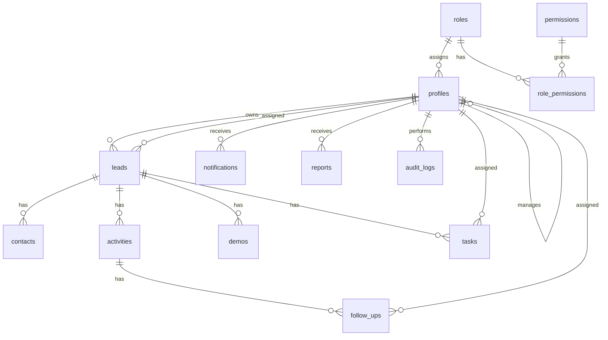

# Persistence Design

PostgreSQL persistence layer for TalentProof Sales CRM via Supabase.

**Milestone**: 5 — Persistence Design  
**Status**: Awaiting approval  
**Scope**: Design only — **no SQL, no migrations, no implementation**

**Source of truth**: [Domain Model](../domain/domain-model.md) (M4, approved)

---

## Document Index

| Section | Content |
|---------|---------|
| [1. Overview](#1-overview) | Purpose and design principles |
| [2. Logical Data Model](#2-logical-data-model) | Domain-to-storage mapping |
| [3. Physical PostgreSQL Model](#3-physical-postgresql-model) | Tables, columns, types |
| [4. Naming Conventions](#4-naming-conventions) | Database naming rules |
| [5. Constraints](#5-constraints) | Business rules as DB constraints |
| [6. Foreign Keys](#6-foreign-keys) | Relationship enforcement |
| [7. Enum Strategy](#7-enum-strategy) | PostgreSQL enum types |
| [8. Audit Fields](#8-audit-fields) | Standard metadata columns |
| [9. Soft Delete Strategy](#9-soft-delete-strategy) | Trash pattern |
| [10. Archive Strategy](#10-archive-strategy) | Lead archive pattern |
| [11. Index Strategy](#11-index-strategy) | Query performance |
| [12. Row Level Security](#12-row-level-security) | RLS policies |
| [13. Migration Strategy](#13-migration-strategy) | Versioned schema changes |
| [14. Seed Strategy](#14-seed-strategy) | Development bootstrap data |
| [15. Derived Views](#15-derived-views) | Timeline (no table) |
| [16. Entity Diagram](#16-entity-diagram) | Physical ER diagram |

---

## 1. Overview

### Purpose

Define how approved domain entities are stored in PostgreSQL so that migrations (post-approval), RLS policies, and feature services implement a single coherent persistence layer.

### Design Principles

| Principle | Application |
|-----------|-------------|
| Domain traceability | Every table maps to a domain entity |
| Supabase Auth integration | `auth.users` for credentials; `profiles` for CRM User |
| RLS by default | Every application table has RLS enabled |
| Soft delete for recoverable entities | `deleted_at` column — not for Activity or AuditLog |
| Archive via outcome | Lead `outcome` + `archived_at` — separate from trash |
| Audit columns on mutable tables | `created_at`, `updated_at`, `created_by`, `updated_by` |
| Immutable logs | Activity and AuditLog are append-only |
| No Timeline table | Chronological view derived at query time |

### Auth Integration

| Layer | Storage |
|-------|---------|
| Credentials | `auth.users` (Supabase managed) |
| CRM profile | `profiles` table linked via `id` = `auth.users.id` |
| Role | `profiles.role_id` → `roles` |

---

## 2. Logical Data Model

Logical entities and their persistence mapping.

| Domain Entity | Logical Store | Notes |
|---------------|---------------|-------|
| User | `profiles` + `auth.users` | Profile extends auth identity |
| Role | `roles` | Reference data |
| Permission | `permissions` | Reference data |
| Role ↔ Permission | `role_permissions` | Junction |
| Lead | `leads` | Aggregate root |
| Contact | `contacts` | Child of Lead |
| Activity | `activities` | Append-only |
| FollowUp | `follow_ups` | Child of Activity; 1:N |
| Demo | `demos` | Child of Lead |
| Task | `tasks` | Optional Lead link |
| Report | `reports` | Generated artifacts |
| Notification | `notifications` | Per-user alerts |
| AuditLog | `audit_logs` | Append-only |
| App config | `app_settings` | Timezone, retention, etc. |
| Timeline | *(derived)* | **No table** — query union |

### Logical Relationships

```
auth.users 1──1 profiles
profiles N──1 roles
profiles N──1 profiles (manager_id, self-ref for team)
roles N──M permissions (via role_permissions)

profiles 1──N leads (owner_id)
profiles 1──N leads (assigned_to_id, nullable)
leads 1──N contacts
leads 1──N activities
leads 1──N demos
leads 1──N tasks
activities 1──N follow_ups
profiles 1──N follow_ups (assigned_to_id)
profiles 1──N tasks (assigned_to_id)
profiles 1──N notifications
profiles 1──N reports (recipient_id)
profiles 1──N audit_logs (actor_id)
```

---

## 3. Physical PostgreSQL Model

### 3.1 `roles`

| Column | Type | Nullable | Description |
|--------|------|----------|-------------|
| id | uuid | PK | Primary key |
| code | text | NOT NULL | Unique role code (`ceo`, `admin`, etc.) |
| name | text | NOT NULL | Display name |
| description | text | YES | Role description |
| created_at | timestamptz | NOT NULL | Audit |
| updated_at | timestamptz | NOT NULL | Audit |

### 3.2 `permissions`

| Column | Type | Nullable | Description |
|--------|------|----------|-------------|
| id | uuid | PK | Primary key |
| code | text | NOT NULL | Unique (`lead:create`) |
| resource | text | NOT NULL | Resource name |
| action | text | NOT NULL | Action name |
| description | text | YES | Human-readable |
| created_at | timestamptz | NOT NULL | Audit |

### 3.3 `role_permissions`

| Column | Type | Nullable | Description |
|--------|------|----------|-------------|
| role_id | uuid | PK, FK | → `roles.id` |
| permission_id | uuid | PK, FK | → `permissions.id` |

### 3.4 `profiles`

| Column | Type | Nullable | Description |
|--------|------|----------|-------------|
| id | uuid | PK, FK | → `auth.users.id` |
| email | text | NOT NULL | Denormalized from auth |
| display_name | text | NOT NULL | |
| phone | text | YES | |
| role_id | uuid | NOT NULL, FK | → `roles.id` |
| manager_id | uuid | YES, FK | → `profiles.id` (team hierarchy) |
| status | user_status | NOT NULL | Enum |
| deleted_at | timestamptz | YES | Soft delete |
| deleted_by | uuid | YES, FK | → `profiles.id` |
| created_at | timestamptz | NOT NULL | Audit |
| updated_at | timestamptz | NOT NULL | Audit |
| created_by | uuid | YES, FK | → `profiles.id` |
| updated_by | uuid | YES, FK | → `profiles.id` |

### 3.5 `app_settings`

| Column | Type | Nullable | Description |
|--------|------|----------|-------------|
| key | text | PK | Setting key |
| value | jsonb | NOT NULL | Setting value |
| description | text | YES | |
| updated_at | timestamptz | NOT NULL | |
| updated_by | uuid | YES, FK | → `profiles.id` |

**Seed keys**: `organization_timezone` (default `Asia/Kolkata`), `trash_retention_days` (default `30`)

### 3.6 `leads`

| Column | Type | Nullable | Description |
|--------|------|----------|-------------|
| id | uuid | PK | |
| title | text | NOT NULL | |
| owner_id | uuid | NOT NULL, FK | → `profiles.id` |
| assigned_to_id | uuid | YES, FK | → `profiles.id` (reassignment) |
| status | lead_status | NOT NULL | `active`, `in_progress`, `trashed` |
| outcome | lead_outcome | YES | `won`, `lost`, `archived` — set when closing |
| source | text | YES | |
| priority | lead_priority | YES | `low`, `medium`, `high` |
| notes | text | YES | |
| archived_at | timestamptz | YES | Set when outcome is set |
| deleted_at | timestamptz | YES | Soft delete (trash) |
| deleted_by | uuid | YES, FK | → `profiles.id` |
| created_at | timestamptz | NOT NULL | |
| updated_at | timestamptz | NOT NULL | |
| created_by | uuid | NOT NULL, FK | → `profiles.id` |
| updated_by | uuid | YES, FK | → `profiles.id` |

**Archive rule**: When `outcome` is set (`won`, `lost`, or `archived`), `archived_at` is set and Lead is in Archive.

### 3.7 `contacts`

| Column | Type | Nullable | Description |
|--------|------|----------|-------------|
| id | uuid | PK | |
| lead_id | uuid | NOT NULL, FK | → `leads.id` |
| first_name | text | NOT NULL | |
| last_name | text | NOT NULL | |
| email | text | YES | |
| phone | text | YES | |
| job_title | text | YES | |
| is_primary | boolean | NOT NULL | Default false |
| deleted_at | timestamptz | YES | |
| deleted_by | uuid | YES, FK | |
| created_at | timestamptz | NOT NULL | |
| updated_at | timestamptz | NOT NULL | |
| created_by | uuid | NOT NULL, FK | |
| updated_by | uuid | YES, FK | |

### 3.8 `activities`

| Column | Type | Nullable | Description |
|--------|------|----------|-------------|
| id | uuid | PK | |
| lead_id | uuid | NOT NULL, FK | → `leads.id` |
| type | activity_type | NOT NULL | Enum |
| description | text | NOT NULL | |
| occurred_at | timestamptz | NOT NULL | |
| created_by | uuid | NOT NULL, FK | → `profiles.id` |
| created_at | timestamptz | NOT NULL | Immutable — no `updated_at` |

**No soft delete. No update after insert** (append-only, BR-ACT-01).

### 3.9 `follow_ups`

| Column | Type | Nullable | Description |
|--------|------|----------|-------------|
| id | uuid | PK | |
| activity_id | uuid | NOT NULL, FK | → `activities.id` |
| lead_id | uuid | NOT NULL, FK | → `leads.id` (denormalized) |
| assigned_to_id | uuid | NOT NULL, FK | → `profiles.id` |
| due_at | timestamptz | NOT NULL | Stored UTC; evaluated in org timezone |
| notes | text | YES | |
| status | follow_up_status | NOT NULL | `pending`, `completed`, `overdue` |
| completed_at | timestamptz | YES | |
| created_at | timestamptz | NOT NULL | |
| updated_at | timestamptz | NOT NULL | |
| created_by | uuid | NOT NULL, FK | |
| updated_by | uuid | YES, FK | |

**Multiple FollowUps per Activity** (OD-07). Minimum 1 at Activity creation.

### 3.10 `demos`

| Column | Type | Nullable | Description |
|--------|------|----------|-------------|
| id | uuid | PK | |
| lead_id | uuid | NOT NULL, FK | |
| scheduled_at | timestamptz | NOT NULL | |
| status | demo_status | NOT NULL | |
| notes | text | YES | |
| created_by | uuid | NOT NULL, FK | |
| deleted_at | timestamptz | YES | |
| deleted_by | uuid | YES, FK | |
| created_at | timestamptz | NOT NULL | |
| updated_at | timestamptz | NOT NULL | |
| updated_by | uuid | YES, FK | |

### 3.11 `tasks`

| Column | Type | Nullable | Description |
|--------|------|----------|-------------|
| id | uuid | PK | |
| lead_id | uuid | YES, FK | Optional |
| assigned_to_id | uuid | NOT NULL, FK | |
| title | text | NOT NULL | |
| description | text | YES | |
| status | task_status | NOT NULL | |
| due_at | timestamptz | YES | |
| completed_at | timestamptz | YES | |
| deleted_at | timestamptz | YES | |
| deleted_by | uuid | YES, FK | |
| created_at | timestamptz | NOT NULL | |
| updated_at | timestamptz | NOT NULL | |
| created_by | uuid | NOT NULL, FK | |
| updated_by | uuid | YES, FK | |

### 3.12 `reports`

| Column | Type | Nullable | Description |
|--------|------|----------|-------------|
| id | uuid | PK | |
| type | report_type | NOT NULL | |
| recipient_id | uuid | NOT NULL, FK | → `profiles.id` |
| period_start | timestamptz | NOT NULL | |
| period_end | timestamptz | NOT NULL | |
| delivery_channel | report_delivery | NOT NULL | `email`, `in_app` |
| summary | jsonb | NOT NULL | Aggregated metrics payload |
| generated_at | timestamptz | NOT NULL | |
| created_at | timestamptz | NOT NULL | |

### 3.13 `notifications`

| Column | Type | Nullable | Description |
|--------|------|----------|-------------|
| id | uuid | PK | |
| recipient_id | uuid | NOT NULL, FK | |
| type | notification_type | NOT NULL | |
| title | text | NOT NULL | |
| body | text | YES | |
| status | notification_status | NOT NULL | `unread`, `read` |
| entity_type | text | YES | Reference entity |
| entity_id | uuid | YES | Reference id |
| read_at | timestamptz | YES | |
| created_at | timestamptz | NOT NULL | |

### 3.14 `audit_logs`

| Column | Type | Nullable | Description |
|--------|------|----------|-------------|
| id | uuid | PK | |
| actor_id | uuid | NOT NULL, FK | → `profiles.id` |
| action | audit_action | NOT NULL | Enum |
| entity_type | text | NOT NULL | |
| entity_id | uuid | NOT NULL | |
| metadata | jsonb | YES | Change summary |
| created_at | timestamptz | NOT NULL | Immutable |

**Append-only. No update. No delete. No RLS delete policy.**

---

## 4. Naming Conventions

| Element | Convention | Example |
|---------|------------|---------|
| Tables | snake_case, plural | `follow_ups`, `audit_logs` |
| Columns | snake_case | `owner_id`, `due_at` |
| Primary keys | `id` (uuid) | `id` |
| Foreign keys | `{entity}_id` | `lead_id`, `assigned_to_id` |
| Enums | snake_case type name | `lead_outcome` |
| Enum values | snake_case | `in_progress` |
| Indexes | `idx_{table}_{columns}` | `idx_leads_owner_id` |
| Unique constraints | `uq_{table}_{column}` | `uq_roles_code` |
| Check constraints | `chk_{table}_{rule}` | `chk_leads_outcome_archived` |
| RLS policies | `{table}_{operation}_{scope}` | `leads_select_own` |

FollowUp maps to table `follow_ups` (canonical entity name in docs/code: FollowUp).

---

## 5. Constraints

### Primary Keys

All tables use `uuid` primary key with `gen_random_uuid()` default at migration time.

### Unique Constraints

| Table | Column(s) | Rule |
|-------|-----------|------|
| roles | code | One row per role |
| permissions | code | One row per permission |
| app_settings | key | One row per setting |
| profiles | email | Unique among non-deleted |

### Check Constraints

| Table | Constraint | Rule |
|-------|-----------|------|
| leads | outcome requires archived_at | If `outcome` IS NOT NULL then `archived_at` IS NOT NULL |
| leads | archived implies outcome | If `archived_at` IS NOT NULL then `outcome` IS NOT NULL |
| leads | trashed vs archived | `status` = `trashed` implies `outcome` IS NULL |
| activities | no soft delete | `deleted_at` column does not exist |
| follow_ups | due after activity | `due_at` validated at application layer |
| contacts | one primary per lead | Partial unique index: one `is_primary = true` per `lead_id` where not deleted |

### Business Rule Constraints

| Rule ID | Enforcement |
|---------|-------------|
| BR-ACT-01 | No DELETE on `activities`; no `deleted_at` column |
| BR-ACT-02 | Application transaction: ≥1 `follow_ups` row per new `activities` row |
| BR-LEAD-04 / OD-02 | `outcome` ∈ {won, lost, archived} triggers `archived_at` |
| BR-DATA-01 / OD-04 | `deleted_at` + 30-day retention enforced by scheduled job |
| BR-FU-01 / OD-03 | Overdue job compares `due_at` in org timezone |
| OD-05 | RLS: Manager UPDATE on team leads; no permanent DELETE for Manager |
| OD-07 | FK allows multiple `follow_ups` per `activity_id` |

---

## 6. Foreign Keys

| Child Table | Column | Parent | On Delete |
|-------------|--------|--------|-----------|
| profiles | role_id | roles | RESTRICT |
| profiles | manager_id | profiles | SET NULL |
| role_permissions | role_id | roles | CASCADE |
| role_permissions | permission_id | permissions | CASCADE |
| leads | owner_id | profiles | RESTRICT |
| leads | assigned_to_id | profiles | SET NULL |
| contacts | lead_id | leads | RESTRICT |
| activities | lead_id | leads | RESTRICT |
| follow_ups | activity_id | activities | RESTRICT |
| follow_ups | lead_id | leads | RESTRICT |
| follow_ups | assigned_to_id | profiles | RESTRICT |
| demos | lead_id | leads | RESTRICT |
| tasks | lead_id | leads | SET NULL |
| tasks | assigned_to_id | profiles | RESTRICT |
| notifications | recipient_id | profiles | CASCADE |
| reports | recipient_id | profiles | RESTRICT |
| audit_logs | actor_id | profiles | RESTRICT |

**RESTRICT** on Lead children prevents orphan records while Lead is active. Soft-deleted Leads retain children until restored or permanently deleted by Admin.

---

## 7. Enum Strategy

Use PostgreSQL `CREATE TYPE` enums for fixed domain values. Application constants in `src/constants/` mirror enum values.

| Enum Type | Values |
|-----------|--------|
| `user_status` | `invited`, `active`, `deactivated` |
| `lead_status` | `active`, `in_progress`, `trashed` |
| `lead_outcome` | `won`, `lost`, `archived` |
| `lead_priority` | `low`, `medium`, `high` |
| `activity_type` | `call`, `email`, `meeting`, `note`, `linkedin`, `other` |
| `follow_up_status` | `pending`, `completed`, `overdue` |
| `demo_status` | `scheduled`, `completed`, `cancelled`, `no_show` |
| `task_status` | `pending`, `in_progress`, `completed`, `cancelled` |
| `report_type` | `daily_ceo`, `pipeline`, `activity`, `custom` |
| `report_delivery` | `email`, `in_app` |
| `notification_type` | `followup_overdue`, `task_due`, `demo_reminder`, `system` |
| `notification_status` | `unread`, `read` |
| `audit_action` | `created`, `updated`, `soft_deleted`, `restored`, `permanent_deleted`, `archived`, `role_changed`, `login`, `logout` |

### Enum Change Policy

1. Add new value via `ALTER TYPE ... ADD VALUE` migration
2. Never remove enum values in production — deprecate in application
3. Document enum changes in migration comments

---

## 8. Audit Fields

### Standard Columns (mutable entities)

| Column | Purpose |
|--------|---------|
| `created_at` | Row creation timestamp (timestamptz, UTC) |
| `updated_at` | Last modification (auto-updated via trigger) |
| `created_by` | `profiles.id` of creator |
| `updated_by` | `profiles.id` of last editor |

**Applies to**: profiles, leads, contacts, follow_ups, demos, tasks

### Append-Only Tables

| Table | Audit approach |
|-------|----------------|
| activities | `created_at`, `created_by` only |
| audit_logs | `created_at` only |
| reports | `generated_at`, `created_at` |
| notifications | `created_at`; `read_at` on status change |

### Triggers (planned at migration)

- `updated_at` auto-set on UPDATE for tables with that column
- AuditLog insertion via service layer on domain mutations

---

## 9. Soft Delete Strategy

### Pattern

| Column | Type | Purpose |
|--------|------|---------|
| `deleted_at` | timestamptz | NULL = active; set = in Trash |
| `deleted_by` | uuid | Who soft-deleted |

### Applies To

`profiles`, `leads`, `contacts`, `demos`, `tasks`

### Does Not Apply To

`activities` (BR-ACT-01), `audit_logs` (immutable), `reports`, `notifications` (hard lifecycle)

### Query Convention

All SELECT policies and application queries filter `deleted_at IS NULL` unless querying Trash explicitly.

### Retention (OD-04)

- Trash retention: **30 days** (`app_settings.trash_retention_days`)
- Scheduled job flags records past retention for Admin review
- Only Admin with `trash:permanent_delete` can hard-delete
- Admin can restore at any time within retention

### Restore

Restore sets `deleted_at = NULL`, `deleted_by = NULL`, reverts `leads.status` from `trashed` to previous status (stored in `metadata` or application state).

---

## 10. Archive Strategy

### Lead Archive (OD-02, BR-LEAD-04)

| Field | Purpose |
|-------|---------|
| `outcome` | `won`, `lost`, or `archived` |
| `archived_at` | Timestamp when Lead closed |

**Rules**:

- Setting any outcome sets `archived_at` and removes Lead from active pipeline
- Archived Leads are read-only for most Roles (except Admin)
- Archived Leads cannot receive new Activities, Contacts, or Demos (VR-X01, VR-X02)
- Archive is **separate from Trash** — archived Leads have `deleted_at IS NULL`

### Views (application layer, not tables)

| View | Filter |
|------|--------|
| Active pipeline | `outcome IS NULL AND deleted_at IS NULL` |
| Archive | `outcome IS NOT NULL AND deleted_at IS NULL` |
| Trash | `deleted_at IS NOT NULL` |

---

## 11. Index Strategy

| Table | Index | Purpose |
|-------|-------|---------|
| profiles | `(role_id)` | Role-based queries |
| profiles | `(manager_id)` | Team hierarchy |
| profiles | `(email)` UNIQUE | Lookup |
| profiles | `(deleted_at)` WHERE NULL | Active users |
| leads | `(owner_id)` | Owner's pipeline |
| leads | `(assigned_to_id)` | Assigned leads |
| leads | `(status)` | Pipeline filters |
| leads | `(outcome)` WHERE NOT NULL | Archive queries |
| leads | `(archived_at)` | Archive sorting |
| leads | `(deleted_at)` WHERE NULL | Active leads |
| leads | `(created_at DESC)` | Recent leads |
| contacts | `(lead_id)` | Lead detail |
| activities | `(lead_id, occurred_at DESC)` | Activity log, Timeline |
| follow_ups | `(assigned_to_id, status)` | My follow-ups |
| follow_ups | `(lead_id)` | Lead follow-ups |
| follow_ups | `(due_at)` WHERE status = pending | Overdue job |
| follow_ups | `(activity_id)` | Activity follow-ups |
| demos | `(lead_id)` | Lead demos |
| demos | `(scheduled_at)` | Upcoming demos |
| tasks | `(assigned_to_id, status)` | My tasks |
| tasks | `(lead_id)` | Lead tasks |
| notifications | `(recipient_id, status)` | Unread count |
| reports | `(recipient_id, generated_at DESC)` | Report history |
| audit_logs | `(entity_type, entity_id)` | Entity audit trail |
| audit_logs | `(actor_id, created_at DESC)` | User actions |
| audit_logs | `(created_at DESC)` | Recent audit |

---

## 12. Row Level Security

RLS **enabled on all tables**. Default deny; explicit policies grant access.

### Helper Functions (planned)

| Function | Returns | Purpose |
|----------|---------|---------|
| `auth.user_id()` | uuid | Current user's profile id |
| `auth.user_role()` | text | Current user's role code |
| `auth.has_permission(code)` | boolean | Permission check |
| `auth.is_admin()` | boolean | Admin shortcut |
| `auth.is_manager_of(user_id)` | boolean | Team scope for Manager |

### Policy Matrix (summary)

| Table | CEO | Admin | Manager | BDE/Marketing/Recruiter |
|-------|-----|-------|---------|------------------------|
| profiles | read all | full | read team | read self |
| leads | read all | full | read/edit/reassign team (OD-05) | CRUD own |
| contacts | read all | full | team leads | own leads |
| activities | read all | read all | team leads | own leads |
| follow_ups | read all | read all | team | own + assigned |
| demos | read all | full | team | own leads |
| tasks | read all | full | team | own + assigned |
| reports | read own | full | read team | read own |
| notifications | own | own | own | own |
| audit_logs | read all | read all | — | — |
| app_settings | read | full | read | read |

### Key RLS Rules

| Rule | Policy |
|------|--------|
| OD-01 | INSERT on leads: role ∈ {admin, manager, bde, marketing, recruiter} |
| OD-05 | Manager: SELECT/UPDATE team leads via `manager_id` chain; no DELETE |
| BR-ACT-01 | No DELETE policy on activities for any role |
| BR-DATA-01 | Trash visible only to Admin; restore/permanent_delete Admin only |
| Archive | UPDATE on archived leads denied except Admin read |
| Service role | Edge functions use service role for scheduled jobs only |

---

## 13. Migration Strategy

### Principles

| Principle | Detail |
|-----------|--------|
| One migration per logical change | `supabase/migrations/YYYYMMDDHHMMSS_description.sql` |
| Idempotent where possible | Use `IF NOT EXISTS` for extensions, types |
| Order | enums → tables → indexes → FKs → RLS → triggers → seed |
| No data migration in schema migrations | Data backfills in separate migration |
| Review before apply | M5 approved design → M6+ writes first migration |

### Planned Migration Phases

| Phase | Milestone | Content |
|-------|-----------|---------|
| 1 | M6 (Auth) | enums, roles, permissions, role_permissions, profiles, app_settings, RLS base |
| 2 | M7 (Users) | profile management policies |
| 3 | M9+ | leads, contacts, activities, follow_ups, demos, tasks per feature |
| 4 | M15+ | reports, notifications |
| 5 | M6+ | audit_logs |

### Rollback

- Forward-only migrations in production
- Destructive changes require explicit ADR and stakeholder approval
- Development: `supabase db reset` for clean slate

---

## 14. Seed Strategy

### Environment Scope

| Environment | Seed approach |
|-------------|---------------|
| Local development | Full seed via `supabase/seed.sql` |
| Staging | Roles + permissions + admin user only |
| Production | Roles + permissions only; no test data |

### Seed Order

1. `roles` (6 roles)
2. `permissions` (full permission set)
3. `role_permissions` (matrix per role)
4. `app_settings` (timezone `Asia/Kolkata`, trash retention 30)
5. Development only: sample users, leads, activities

### Reference Seed Data

**Roles**: ceo, admin, manager, bde, marketing, recruiter

**Default app_settings**:

| key | value |
|-----|-------|
| organization_timezone | `Asia/Kolkata` |
| trash_retention_days | `30` |

**Development users** (local only): one user per role with known credentials documented in `.env.example` comments — not committed.

### Permission Seed Highlights (OD-01, OD-05)

| Role | lead:create | lead:update (team) | trash:permanent_delete |
|------|-------------|-------------------|------------------------|
| admin | ✓ | ✓ all | ✓ |
| manager | ✓ | ✓ team | ✗ |
| bde | ✓ | ✓ own | ✗ |
| marketing | ✓ | ✓ own | ✗ |
| recruiter | ✓ | ✓ own | ✗ |
| ceo | ✗ | ✗ | ✗ |

---

## 15. Derived Views

### Timeline View (not a table)

**Type**: Derived read model — application query union  
**Purpose**: Chronological view of all engagement on a Lead  
**Storage**: None

**Sources** (unioned by `occurred_at` / `due_at` / `scheduled_at`):

| Source | Sort field | Event type |
|--------|-----------|------------|
| activities | `occurred_at` | activity |
| follow_ups | `due_at` | follow_up |
| demos | `scheduled_at` | demo |
| tasks | `due_at` or `created_at` | task |

**Access**: Feature query in `features/leads/` or shared service — not a PostgreSQL materialized view at launch (may add later for performance).

**Domain reference**: [Timeline View](../domain/domain-model.md#11-timeline-view-derived)

### Dashboard (OD-06)

Primary reporting interface — aggregates from leads, activities, follow_ups, demos, tasks. No `dashboard` table. Email Report is a scheduled summary via `reports` table. Manual export reads same aggregates.

---

## 16. Entity Diagram



---

## Approval Checklist

- [ ] Logical model maps all domain entities
- [ ] Physical model supports OD-01 through OD-07
- [ ] Soft delete and archive strategies clear
- [ ] RLS matrix approved
- [ ] Migration and seed phases acceptable
- [ ] Timeline remains derived (no table)
- [ ] Ready for migration implementation (post-approval)
